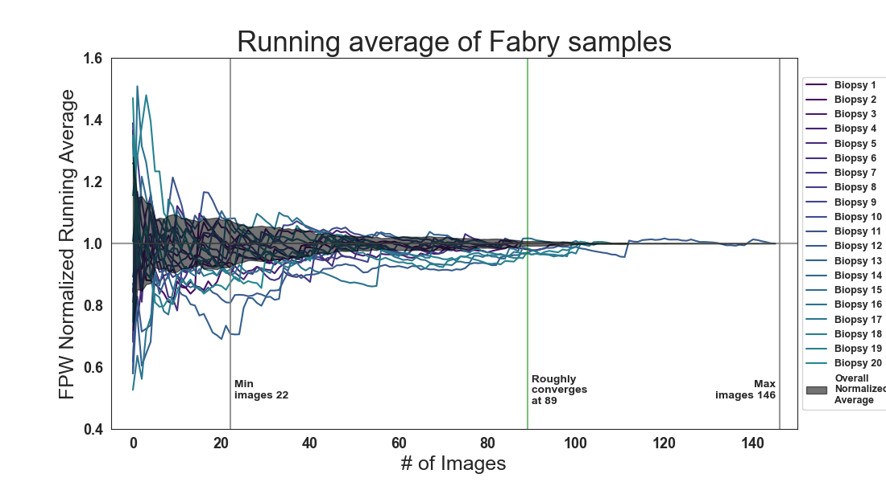

# Automated FPW Measurements using DL
Developed by David Smerkous at Najafian Lab.

# Overview
This repository contains the trained model, vision scripts, and relevant code to automate foot process width estimation on electron microscopy images. The model was trained on ~1024x1024 segmented EM images. The sample EM images were taken where the scaling was about 10nm/pixel, at ~30,000X magnification. The images were then downscaled to 640x640 for the custom ForkNet model. Please ensure good contrast and quality of datasets if intended for use. You can read the accompanying paper [here](https://www.kidney-international.org/article/S0085-2538(23)00675-0/fulltext).

## Image Examples
Here are a few examples of EM images with varying quality.
| [](images/good.png)  | [](images/bad.png) |
|:---:|:---:|
| Higher quality image with slits/membrane edges that are well defined | Lower quality image with harder to identify slits and poor membrane edge contrast |

| [](images/good2.png)  | [](images/okay.png) |
|:---:|:---:|
| Okay quality image with good slit definition and good membrane/podocyte contrast | Lower quality image that contains bad contrast and artifacts |

The easier it is for you to identify the components and slits in the image, the better the results of the ML model/vision scripts will be. As described in the paper, please use images that have good contrast between cells and membranes, with fewer artificats, and are of similar magnification that the model was trained on.

## System Recommendations
For faster results we recommend an NVIDIA GPU that's equivalent to or better than a GTX 1070, and a modern PC. Just as a reference we used an AMD Ryzen 3900X with a Titan RTX (trained in ~2019), to generate the FPW estimates for the paper, with 64Gb of system ram and 24Gb of VRAM. Although other configurations will work, we cannot ensure inference time will be fast or if the model will even load with systems that have low GPU RAM or system RAM. We highly recommend running this on Linux as it has the best support for ML when it comes to GPUs and docker images. Although you could run this model on CPU, we wouldn't recommend it for larger datasets.

# Docker Installation
If you're familiar with docker, or even if you're not entirely familiar, this is the easiest option to get all of the requirements/dependencies and code working out of the box with no fiddling. The only requirement is for those who want to use a GPU that they install the [nvidia-docker](https://docs.nvidia.com/ai-enterprise/deployment-guide/dg-docker.html). However, it should be noted that although windows supports docker it does [NOT support](https://github.com/NVIDIA/nvidia-docker/wiki/Frequently-Asked-Questions#is-microsoft-windows-supported) nvidia/GPU dockers. Thus, for windows users you must use the CPU only version or install through the [Conda Installation](#conda-installation).

### Pull the docker image
The docker image is available publicly on dockerhub at [smerkd/forknetv5](https://hub.docker.com/repository/docker/smerkd/forknetv5/general) Use this command to pull that image.
```bash
docker pull smerkd/forknetv5:latest  # get the latest image
docker tag smerkd/forknetv5:latest fpwdlv1  # tag for easy run use
```


# Conda Installation
It's highly recommended to use the docker installation as it will be a smoother process and all dependencies within the container are already installed. Since the model was trained on Tf-v1, all the way back in 2018/2019, it is required to use the dependencies provided in the `environment.yml` for this to run. The docker image will have all the correct dependencies installed. If you would like to use the website, currently in alpha, to process the images visit [here](https://fpwdl.smerkous.com).

### Anaconda and Command Line
The installation does require a recent installation of anaconda. Please visit [anacondas page](https://docs.conda.io/projects/conda/en/latest/user-guide/install/download.html) for more info. Furthermore, installation and usage of this repo requires basic knowledge of command line. This project was developed in linux, but should be able to run on any system.

### Clone the repo
```bash
git clone https://github.com/najafian-lab/fpw-dl-v1.git
cd fpw-dl-v1
```

### Create the anaconda environment and download dependencies
```bash
conda env create --file environment.yml
```
This will create a new anaconda environment called `fpw-dl` and download all of the dependencies. Also, this package requires usage of Keras 2.2.4 and Tensorflow 1.15 (GPU version requires CUDA 10.0, CUDNN 7.6). The model and weights that we used for this paper were trained before v2. So other versions of TF will not work. If some of the dependencies are not found for your distribution, then please modify the `environment.yml` dependencies.

*Note for **Windows** users: if you're having issues activating on command prompt/powershell and aren't familiar with Anaconda, I recommend just using the Anaconda Prompt (search it in the windows search bar)*

### Activate the environment
```bash
conda activate fpw-dl
```

# Usage
Below is the guide to using this code/model to analyze images and create a report. The guide is very similar for both the docker based and "native Anaconda" solutions. There will be two versions of the command for each setup. Please modify the script as needed for your system.

## Downloading the Dataset
The dataset that was used to evaluate the model, as presented in the paper, is too large for github. So a public [google drive folder](https://drive.google.com/drive/folders/1o4VukfiqH6GBm7-h9FlDfIK0-8wJ5JAf?usp=sharing) has been provided, and an easy to use download script is in this repo. The download script will download all the zip file from google drive and extract it in the repository directory. This dataset will consume **~40Gb** of disk space. If for some reason the script fails, due to Google changing something to their site, then please download the zips above and unzip them into the `datasets` folder as described below. 


**Docker**
```bash
# "-v $(pwd)/dataset:/dataset" tells docker to mount the current working directory's dataset folder to the /dataset folder in the container
# please adjust the $(pwd) depending on your use case and system. It's wise to put the full path
mkdir dataset  # create the dataset folder
docker run -v $(pwd)/dataset:/dataset fpwdlv1 download.py # please be patient as this might take a while
```

**Anaconda**
```bash
python download.py # please be patient as this might take a while
```

## Analyzing FPW on conditions
The few conditions analyzed in the paper were a random assortment of TEM images trained on fabry, and normal patients. To see how well it would generalize to other conditions we also included some other conditions. Please see the [Overview](#Overview) for a description of the images. Use the `analysis.py` script to produces the segmentation masks and process the images.


**Docker**
```bash
# "dataset/fabry" and "dataset/normal" are the folders to process 
# "--bulk" flag indicates multiple-subfolders to process 
# "-bs 12" flag indicates a batch size of 12 (CHANGE THIS)
# "--gpus all" if nvidia-docker is installed/configured it allows the docker to access GPUS. Note this is only available on linux!
# process fabry males
mkdir -p output/fabry
docker run -v $(pwd)/dataset:/dataset -v $(pwd)/output:/output --gpus all fpwdlv1 analysis.py /dataset/fabry -o /output/fabry --bulk --use_file_average -bs 12

# process normal
mkdir -p output/normal
docker run -v $(pwd)/dataset:/dataset -v $(pwd)/output:/output --gpus all fpwdlv1 analysis.py /dataset/normal -o /output/normal --bulk --use_file_average -bs 12

# process fabry females
mkdir -p output/fabry-f
docker run -v $(pwd)/dataset:/dataset -v $(pwd)/output:/output --gpus all fpwdlv1 analysis.py /dataset/fabry-f -o /output/fabry-f --bulk --use_file_average -bs 12

# process minimal change disease
mkdir -p output/mcdfsgs
docker run -v $(pwd)/dataset:/dataset -v $(pwd)/output:/output --gpus all fpwdlv1 analysis.py /dataset/mcdfsgs -o /output/mcdfsgs --bulk --use_file_average -bs 12

# process diabetic kidney disease
mkdir -p output/dkd
docker run -v $(pwd)/dataset:/dataset -v $(pwd)/output:/output --gpus all fpwdlv1 analysis.py /dataset/dkd -o /output/dkd --bulk --use_file_average -bs 12
```

**Anaconda**
```bash
# "dataset/fabry" and "dataset/normal" are the folders to process 
# "--bulk" flag indicates multiple-subfolders to process 
# "-bs 12" flag indicates a batch size of 12 (CHANGE THIS)
# process fabry
mkdir -p output/fabry
python analysis.py dataset/fabry -o output/fabry --bulk --use_file_average -bs 12

# process normal
mkdir -p output/normal
python analysis.py dataset/normal -o output/normal --bulk --use_file_average -bs 12

# similar process for rest. Just replace {condition} in output/{condition} and dataset/{condition}, and the available conditions such as fabry-f, mcdfsgs, normal, fabry, and dkd
```
There are certain flags that might be useful, if you've already processed the dataset once. For example, `--pskip` will skip prediction and go straight to vision processing. Please see `python analysis.py --help` for more options.


## Viewing the results
### Segmentation Masks
In the `--bulk` report each folder inside the input folder is treated as a single biopsy, and predicted masks are outputed with a similar biopsy name in the `output` folder. For example, `output/fabry/15-0079/prediction` will contain all of the `.tiff` layered segmentation masks for that biopsy.

### Vision results
The `analysis.py` script will produce the layered segmentation masks and also process the output of the masks. The script will process the membrane edge and slits to generate an estimate of the FPW. All of the processed FPW estimate results are going to be located in the `output/fabry` and `output/normal` folders in a spreadsheet called `bulk_report.xlsx`, only if the bulk flag - as described below, - is specified and the same output folder usage is used as above. Finally, more descriptive file by file measurements are in each of the individual biopsy folders, such as `output/fabry/15-0079/prediction`, where there will be a `report.xlsx`. 

### Bulk flag
The `--bulk` flag will indicate each folder inside the input folder, like `dataset/fabry`, is going to be a biopsy. Without this flag the analysis script will assume the input folder is a single biopsy. This flag will also generate a `output/fabry/bulk_report.xlsx` inside the prediction folder, which will show the global results for each biopsy.

### Preview flag
Using the `--preview` flag when processing with `analysis.py` will show previews of the segmentation masks and vision processing results. Please see the `ilog` function in `analysis.py` if you wish to save the results to a file location.

Here are a few examples of the previews generated
|  |  |
|:---:|:---:|
| Example of a good predicition. Example on higher quality image | Example of a bad prediction. Some could be even worse |

|||
|:---:|:---:|
| Post-process results of random image with more membrane attachment | Post-process results of random image with less membrane attachment. |

The worse example shows the sensitivity of some ML models. This can be due to varying quality of images and the size of our training set. We're training a more complicated and better model, with a larger dataset, to better handle various images, but for best results on this model please consider pre-screening/post-screening your images.

*Note: all measurements shown in the post-processing are measured along the membrane edge and not directly. Also, you can change the individual colors of the measurements, to distinctly tell the difference, from red if you look at the end of `process_slits` function in `slits.py`*

## Evaluating the model
The evaluation dataset inside `dataset/eval` contains two folders called `images` and `masks`. The `images` folder are randomly selected EM images, with their respective ground truth masks in the `masks` folder. Some images were taken from the training masks and some from the validation set, the ratio between them is unknown as the data has been long missing. To run the evaluation please use the following commands


**Docker**
```bash
# first the predicted masks need to be produced
# "--vskip" flag to skip vision processing and only generate masks
# "-bs 12" batch size of images to process (CHANGE THIS)
# "--gpus all" if nvidia-docker is installed/configured it allows the docker to access GPUS. Note this is only available on linux!
mkdir -p output/eval
docker run -v $(pwd)/dataset:/dataset -v $(pwd)/output:/output --gpus all fpwdlv1 analysis.py /dataset/eval/images -o /output/eval --vskip -bs 12

# generate the dice scores based off of the ground truth and the predicted masks
docker run -v $(pwd)/dataset:/dataset -v $(pwd)/output:/output fpwdlv1 eval.py
```

**Anaconda**
```bash
# first the predicted masks need to be produced
# "--vskip" flag to skip vision processing and only generate masks
# "-bs 12" batch size of images to process (CHANGE THIS)
mkdir -p output/eval
python analysis.py dataset/eval/images -o output/eval --vskip -bs 12

# generate the dice scores based off of the ground truth and the predicted masks
python eval.py
```
This will generate the dice scores on all of the input images and group them together by biopsy using their two number prefix. The results will be produced in the `dices.xlsx` file. You should get the same aggregate numbers to the ones below.

|Biopsy Prefix|Membrane Average|Membrane STD|Slit Average|Slit STD|
|:---:|:---:|:---:|:---:|:---:|
|08|0.87|0.04|0.54|0.07|
|09|0.83|0.05|0.51|0.06|
|10|0.47|0.23|0.30|0.17|
|12|0.82|0.07|0.52|0.13|
|13|0.79|0.24|0.58|0.18|
|14|0.85|0.19|0.58|0.15|
|16|0.90|0.02|0.59|0.03|

*Note: look at biopsy prefix 10 and the input images. A lot of images are of low quality compared to biopsy prefix 16*


## Generating Figures
After analyzing a dataset you may use the `figure.py` script to generate some figures using matplotlib. For example, use the following command to generate the running average graphs after running the `analysis.py` on the datasets.
```bash
python figure.py sampled_convergence
```
<!-- # note: the running_average_num is a MAX biopsy count. Does not guarantee that biopsy count

# figure for fabry dataset
python figure.py --running_average --running_average_file output/fabry/running_average_individual.json --running_average_num 20 --running_average_offset 0 --running_average_title "Running average of Fabry samples" --running_average_use_overall_average --running_average_show_convergence

# figure for normal dataset
python figure.py --running_average --running_average_file output/normal/running_average_individual.json --running_average_num 20 --running_average_offset 0 --running_average_title "Running average of normal samples" --running_average_use_overall_average --running_average_show_convergence -->


**Docker variant**
For docker, given the above commands are simple and just add `docker run -v $(pwd)/dataset:/dataset -v $(pwd)/output:/output fpwdlv1` before the figure commands, remove the `python`, and note everything will be put into the `output` directory. Also note that all folders that are relative such as `output` should be `/output` for the docker image.

That commands will produce something similar to the image(s) below in the file `running_average.png`. Note your empirical CDF might be different by just a couple images due to sampling. This graph is particularly useful for noise analysis and understanding, roughly, how many images need to be sampled for FPW averages to converge per biopsy. To see the other images please see the saved `images/sampled_{condition}.png`. Your results should be similar to those on the same dataset.
<!-- ||| -->
||
Please use `python figure.py --help` for more figure options.

## Note
A cross platform version of the Report Utility has not been well tested and has some bugs. We're working on fixing them and publishing a web version of the utility. So currently all processing must be done through the CLI.

## Issues
If there are any issues with the repository or process, please message David Smerkous at smerkd@uw.edu, and/or Dr. Behzad Najafian at najafian@uw.edu.